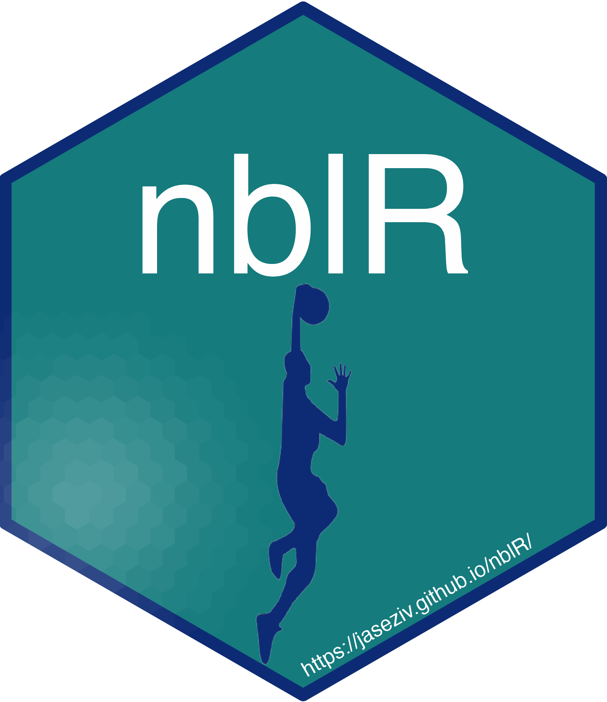

<!-- README.md is generated from README.Rmd. Please edit that file -->

```{r, include = FALSE}
knitr::opts_chunk$set(
  collapse = TRUE,
  comment = "#>",
  fig.path = "man/figures/README-",
  out.width = "100%"
)
options(tibble.print_min = 5, tibble.print_max = 5)
```

# nblR 

<!-- badges: start -->
[](https://CRAN.R-project.org/package=nblR)
[](https://CRAN.R-project.org/package=nblR)
[](https://cran.r-project.org/package=nblR)

[)](https://github.com/JaseZiv/nblR/)
[](https://github.com/JaseZiv/nblR/actions/workflows/R-CMD-check.yaml)
<!-- badges: end -->

## Overview

This package is designed to allow users to obtain clean and tidy data from the Australian National Basketball League (NBL).


## Installation

You can install the CRAN version of [**```nblR```** ](https://CRAN.R-project.org/package=nblR) with the below.

```{r cran-installation, eval=FALSE}
install.packages("nblR")
library(nblR)
```


Alternatively, you can install the dev (little less stable) version of [**```nblR```**](https://github.com/JaseZiv/nblR/) from [GitHub](https://github.com/JaseZiv/nblR) with:

```{r gh-installation, eval=FALSE}
# install.packages("remotes")
remotes::install_github("JaseZiv/nblR")
library(nblR)
```


## Usage


### How To

To get a better understanding of how to use the library, see the package [vignette](https://jaseziv.github.io/nblR/articles/using-nblR.html)

***

## Contributing

### Issues and Improvements

When creating an issue, please include:

* Reproducible examples
* A brief description of what the expected results are
* For improvement suggestions, what features are being requested and their purpose 


Feel free to get in touch via email or twitter https://twitter.com/jaseziv if you aren't able to create an issue.


### Show your support
Follow me on Twitter ([jaseziv](https://twitter.com/jaseziv)) for updates

If this package helps you, all I ask is that you star this repo. If you did want to show your support and contribute to server time and data storage costs, feel free to send a small donation through the link below.

<a href="https://www.buymeacoffee.com/jaseziv83A" target="_blank"></a>

***

## Acknowledgement

Big thanks to [Jacquie Tran](https://github.com/jacquietran) for the inspiration her [`wnblr`](https://github.com/jacquietran/wnblr) library gave for this one.

Also, thanks to the NBL for being the league it is!
