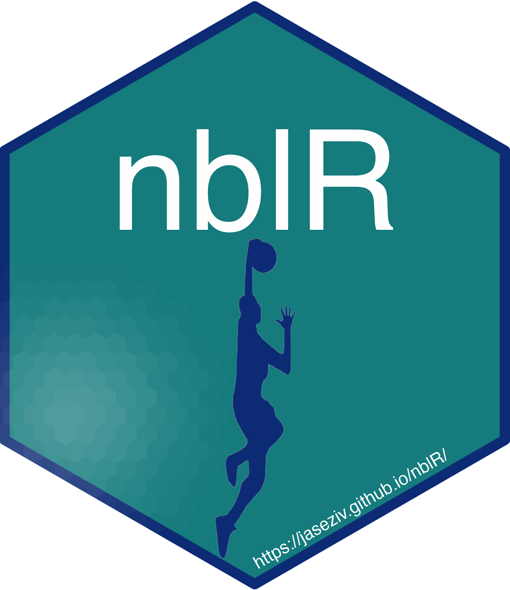

<!-- README.md is generated from README.Rmd. Please edit that file -->

# nblR 

<!-- badges: start -->

[)](https://github.com/JaseZiv/nblR/)
<!-- badges: end -->

## Overview

This package is designed to allow users to obtain clean and tidy data
from the Australian National Basketball League (NBL).

## Installation

You can install the released version of
[**`nblR`**](https://github.com/JaseZiv/nblR/) from
[GitHub](https://github.com/JaseZiv/nblR) with:

``` r
# install.packages("remotes")
remotes::install_github("JaseZiv/nblR")
library(nblR)
```

## Usage

### How To

To get a better understanding of how to use the library, see the package
vignette

------------------------------------------------------------------------

## Contributing

### Issues and Improvements

When creating an issue, please include:

-   Reproducible examples
-   A brief description of what the expected results are
-   For improvement suggestions, what features are being requested and
    their purpose

Feel free to get in touch via email or twitter
<https://twitter.com/jaseziv> if you aren’t able to create an issue.

### Show your support

Follow me on Twitter ([jaseziv](https://twitter.com/jaseziv)) for
updates

If this package helps you, all I ask is that you star this repo

------------------------------------------------------------------------
